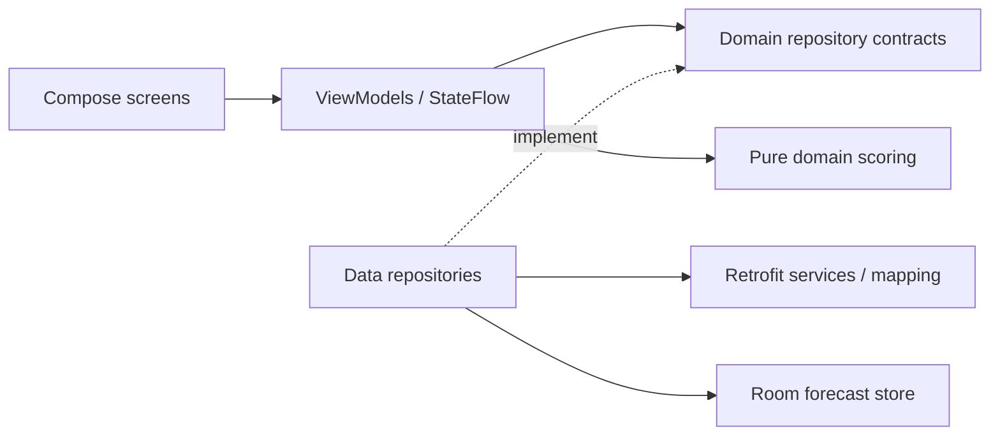

# WeatherPal

## Project overview

WeatherPal is a native Android app built for the Mobile Software Engineer test. It uses Open-Meteo to search for cities and rank **skiing, surfing, outdoor sightseeing, and indoor sightseeing** for each of the next seven days. The app runs entirely on the device and calls the public APIs directly; no backend or API key is required.

The main flow is:

1. Submit a city name and choose a result, disambiguated by region and country.
2. Browse **today plus the following six days in the selected city's timezone**, using the date strip or swiping between days.
3. See all four activities ranked with suitability labels. Expand a card to see the weather inputs and reasoning behind its recommendation.
4. Pull to refresh without losing the selected date. Reopen a recent cached city to view its saved forecast offline.

The brief leaves weather fields and scoring rules open. Our [agreed implementation specification](docs/implementation-specification.md) records those product decisions, including submit-only search, deterministic scoring, and a three-city cache. Later UI and snapshot additions are documented in the [UI notes](docs/ui-redesign.md) and [verification record](docs/verification.md).

The optional features implemented are persistent offline caching, pull-to-refresh, system light/dark themes, snapshot tests, and animated activity cards. Full UI test coverage remains outside the scope. Functional and state-handling checks preceded the later visual refinement.


### README guide

The following sections cover the twelve README topics requested in the brief:

- [Project overview](#project-overview)
- [Platform and tooling choices](#platform-and-tooling-choices)
- [Architecture and technical decisions](#architecture-and-technical-decisions)
- [Build and run](#build-and-run)
- [Running tests and testing strategy](#running-tests-and-testing-strategy)
- [API usage notes](#api-usage-notes)
- [Activity recommendation logic](#activity-recommendation-logic)
- [Assumptions](#assumptions)
- [Trade-offs and omissions](#trade-offs-and-omissions)
- [Production readiness](#production-readiness)
- [Cross-platform delivery](#cross-platform-delivery)
- [AI usage disclosure](#ai-usage-disclosure)

## Platform and tooling choices

**Android with Kotlin** uses the existing native project and satisfies the brief's choice of either Android or iOS. The application has one Gradle app module, min SDK **24**, and compile/target SDK **36**.

- **Jetpack Compose and Material 3:** declarative screens render immutable ViewModel state, with native lifecycle, accessibility, and system-theme support.
- **MVVM, Coroutines, and StateFlow:** suspend functions represent requests; observable state represents search, cached forecasts, loading, and recoverable errors. Cancellation follows navigation and ViewModel lifetimes.
- **Repository interfaces and manual dependency injection:** presentation depends on replaceable contracts. Constructor injection keeps production wiring visible and lets tests supply fakes without a DI framework.
- **Retrofit, OkHttp, and kotlinx.serialization:** typed request/response contracts isolate HTTP and JSON from domain logic. Separate mapping validates data before it can enter the cache.
- **Room:** persistent forecasts remain available offline, and transactions keep forecast values, update metadata, and eviction consistent.
- **JUnit, coroutines-test, handwritten fakes, and MockWebServer:** deterministic checks exercise rules, state transitions, and HTTP contracts. Room/Compose device tests and Roborazzi/Robolectric snapshots cover behavior that pure unit tests cannot establish.

Versions are pinned in [the version catalog](gradle/libs.versions.toml): AGP **8.12.3**, Kotlin/Compose compiler/serialization plugin **2.0.21**, Compose BOM **2024.12.01**, Activity **1.9.3**, Lifecycle **2.8.7**, Room **2.6.1**, Coroutines **1.9.0**, kotlinx.serialization **1.7.3**, Retrofit **2.11.0**, OkHttp/MockWebServer **4.12.0**, desugar_jdk_libs **2.1.4**, Robolectric **4.14.1**, and Roborazzi **1.39.0**. The compatible, locally verified set preserves the project's SDK baseline. Room uses kapt; its Kotlin 1.9 processing fallback is expected with this setup.

## Architecture and technical decisions

### Responsibilities and dependencies

Source packages live under `app/src/main/java/com/example/weatherpal/`:

- **`domain/model`, `domain/repository`, `domain/scoring`:** Android-independent values and contracts, score calculation, reason codes, snow aggregation, and city-local date windows.
- **`data/remote`:** separate geocoding/forecast services, DTOs, HTTP configuration, validation, normalization, cooldowns, and failure translation.
- **`data/local`:** Room entities, DAOs, transactional reads, selective writes, and the exported database schema.
- **`data/repository`:** remote/cache coordination, refresh ownership, cancellation, and capacity enforcement.
- **`ui/search`, `ui/forecast`, `ui/theme`:** explicit ViewModel state, Compose screens, presentation text, and system-theme styling. Numerical scores stay internal.
- **`core/AppDispatchers`:** injectable UI coroutine dispatcher. Retrofit and Room manage their own asynchronous I/O.
- **`di/AppContainer`:** application-scoped database and HTTP client, repositories, `Clock`, dispatcher, cache policy, and saved-state-aware ViewModel factories.



**Why this structure:** package boundaries keep scoring independent of Android and allow presentation/data dependencies to be replaced in tests. One module avoids extra Gradle configuration for a small two-screen app; the trade-off is that layer boundaries are conventions rather than separate module compilation boundaries. Manual DI makes the small object graph easy to inspect. Additional use-case classes are reserved for meaningful orchestration rather than forwarding every repository call.

### Explicit state and error recovery

[SearchViewModel](app/src/main/java/com/example/weatherpal/ui/search/SearchViewModel.kt) models `Idle`, `Loading`, `Results`, `Empty`, and `Error`. Editable text is separate from the submitted query, so editing cannot trigger a request or change what Retry submits. Request identity and cancellation prevent stale responses from replacing newer results. Recent places and their storage error have independent state and retry behavior.

[ForecastViewModel](app/src/main/java/com/example/weatherpal/ui/forecast/ForecastViewModel.kt) models `Closed` or `Open`. An open forecast owns the city and selected date once, with independent content (`InitialLoading`, `InitialError`, `Ready`) and refresh (`Idle`, `Refreshing`, `Failed`) states. This lets existing content remain usable during a refresh or after a refresh error. Initial failures show a full error/retry screen; refresh failures retain content and the previous successful-update time. Cancellation caused by leaving a screen is not presented as a network error.

One selected-date value synchronizes the timeline and pager. City/date keys and saveable page state preserve navigation, scrolling, and card expansion across updates. On resume or visible city-local midnight, the window is reconciled; a still-valid selection survives, otherwise today is selected. A rollover during an active request queues one refresh for the new window. Saved state serializes city/date and search text; invalid or expired restored dates fall back to today. Rotation retains ViewModels, while saved-state reconstruction is tested separately from full OS process-death behavior.

### Persistent cache and coherent updates

**Room is the authoritative forecast stream.** A network result is validated and committed before observers can display it. Keeping one publication path avoids mixing fresh rankings with stale weather or displaying data that failed to persist.

- City IDs identify entries; ISO city-local dates identify day rows. Names are display labels, so identically named cities remain distinct.
- `CachePolicy(maxCities=3)` is developer configuration and requires a value of at least one. A new city at capacity evicts the oldest successful update, breaking ties by smallest city ID. Shortcuts sort by successful update descending, then ID ascending. Opening a city or failing a request does not change recency.
- Cached content appears first, followed by one automatic refresh. Offline failures leave saved values accessible; expired or uncovered dates are explicitly unavailable.
- Metadata, changed rows, update timestamp, and eviction commit atomically. Unchanged success updates the timestamp without rewriting day rows; changed dates update only changed columns. New dates insert and omitted dates delete. Missing values in a new response are not filled from older forecasts.
- Same-city callers share a live refresh; writes across cities are serialized. Cancelling a waiter preserves the owner. Active waiters can replace a cancelled owner, and stale responses or cleanup cannot publish over replacement work.
- Storage failures have explicit recovery: **Retry recent places** restarts shortcut observation, and forecast retry restarts a failed observer without duplicating network work.

The three-city bound keeps offline access useful while limiting persistence and eviction complexity. Recency uses the injected device clock; it measures successful data updates rather than a strict search history. Transaction rollback, selective writes, and concurrency are covered by repository and Room tests. The [specification](docs/implementation-specification.md) and [verification record](docs/verification.md) contain the detailed contracts and evidence.

## Build and run

Use Android Studio, **JDK 21** (the verified runtime), Android SDK Platform **36**, and Build Tools **36.0.0**. The checked-in Gradle wrapper is **8.13**. Verification used Windows 11, Android Studio's JetBrains Runtime **21.0.6**, and an Android 16 / API 36 x86_64 emulator named `Medium_Phone`.

Java/Kotlin bytecode targets **11**; this is separate from the JDK that runs Gradle. Core-library desugaring provides `java.time` support on API 24/25. The minimum supported runtime is Android **API 24**, although minimum-API device execution has not yet been verified.

1. Open the repository root in Android Studio.
2. Install the SDK packages above, select JDK 21 for Gradle, and sync. First-time dependency downloads require internet access.
3. Set the SDK path in untracked `local.properties`; Android Studio normally creates this file.
4. Start an API 24+ emulator or connect an Android device, select the `app` configuration, and Run.

Equivalent PowerShell commands from the repository root:

```powershell
$env:JAVA_HOME = 'C:/Program Files/Android/Android Studio/jbr'
./gradlew.bat :app:assembleDebug
./gradlew.bat :app:installDebug
```

Adjust `JAVA_HOME` to your JDK installation. On macOS/Linux, use `./gradlew` in place of `./gradlew.bat`; use `bash ./gradlew` if the executable bit is unavailable.

The APK is written to `app/build/outputs/apk/debug/app-debug.apk`. Launch **WeatherPal** from the device launcher. A fresh launch opens search. No secrets file, backend setup, GPS, or location permission is needed; the app requests `INTERNET` permission. New searches and fresh forecasts require connectivity; previously cached forecasts can be viewed offline.

## Running tests and testing strategy

### Commands

Use the same JDK/SDK setup as the build. Run from the repository root:

```powershell
# Core JVM unit suite; no emulator or live API required.
./gradlew.bat :app:testDebugUnitTest

# Room persistence and Compose interactions; requires a running device/emulator.
./gradlew.bat :app:connectedDebugAndroidTest

# Visual regression checks; use Windows/JDK 21 to match the baselines.
./gradlew.bat :app:verifyRoborazziDebug --tests '*WeatherSnapshotTest*'

# Normal build, unit, and static-analysis gate.
./gradlew.bat :app:assembleDebug :app:testDebugUnitTest :app:lintDebug
```

The connected suite requires an API 24+ device visible to `adb`. Snapshots use Robolectric on the JVM and need no emulator. Ordinary unit runs skip snapshot rendering unless a Roborazzi mode is enabled. Baseline review and update commands are in the [snapshot testing guide](docs/snapshot-testing.md).

### What the tests establish

Tests prioritize rules and state transitions that can produce incorrect recommendations, stale screens, or lost cached data:

- **[ScoringTest](app/src/test/java/com/example/weatherpal/domain/ScoringTest.kt):** component/label boundaries, worked examples, ties, indoor/outdoor complementarity, missing/invalid inputs, depth preference, snowfall fallback, medians, coverage, DST, and city-local windows.
- **[RemoteTest](app/src/test/java/com/example/weatherpal/data/RemoteTest.kt):** MockWebServer verifies encoded parameters and HTTP behavior; fixtures exercise filtering, units, dates, partial/malformed payloads, cancellation, transport recovery, and Retry-After deadlines.
- **[RepositoryTest](app/src/test/java/com/example/weatherpal/data/RepositoryTest.kt):** cache preservation, unchanged success, shared refresh ownership, cancellation/re-entry, and provider cooldowns across cities.
- **[ViewModelTest](app/src/test/java/com/example/weatherpal/ui/ViewModelTest.kt) and [PresentationTest](app/src/test/java/com/example/weatherpal/ui/PresentationTest.kt):** explicit submission, stale responses, cached-first rendering, retry, selection preservation, saved-state reconstruction, midnight rollover, observer recovery, and explanation formatting.
- **[Device tests](app/src/androidTest/java/com/example/weatherpal):** Room eviction, capacity, selective writes, atomic rollback, coherent observation, and file-backed persistence; Compose card disclosure/state restoration and recent-places retry.
- **[WeatherSnapshotTest](app/src/test/java/com/example/weatherpal/ui/snapshot/WeatherSnapshotTest.kt):** 17 scenarios in both themes, including search/forecast errors, offline content, missing dates, landscape, large text, and expanded/collapsed cards; 34 checked-in PNG baselines.

Handwritten fakes replace repository/remote/store dependencies. Injected dispatchers and `Clock` make coroutine timing and date behavior deterministic with virtual time. MockWebServer tests the HTTP boundary without relying on public-service uptime. SQLite triggers check actual writes and rollback rather than merely comparing final objects. Live API walkthroughs supplement these checks; they are not deterministic test oracles.

### Recorded verification and limits

The [October 8, 2026 verification record](docs/verification.md) reports **46 core unit tests**, **11 connected tests**, and **34 snapshot cases** passing in their respective runs. The combined snapshot-enabled JVM run passed **80 tests**. Debug assembly and lint passed; the latest recorded lint result is **0 errors / 30 warnings**, including dependency-version and kapt advisories. Connected tests were last run before the test-only snapshot additions; application and connected-test sources were unchanged by that addition.

[Android checks](.github/workflows/android-checks.yml) configures Linux debug assembly/unit/lint and Windows snapshot verification on pushes and pull requests with JDK 21/SDK 36. The commands passed locally; the hosted workflow has not been executed in the recorded sessions. Native snapshot rendering is host-sensitive, so cross-OS pixel parity is not assumed.

Reports regenerate under `app/build/reports/tests/testDebugUnitTest/`, `app/build/reports/androidTests/connected/debug/`, `app/build/reports/roborazzi/`, and `app/build/reports/lint-results-debug.html`.

**Manual smoke check:** search for Lisbon, choose a result, select a future date, and pull to refresh. Return to search, disable networking, and reopen the cached city: saved content should remain visible with a retry error. Restore connectivity and retry; the date should stay selected. Leave/reopen during refresh, rotate, switch system theme, and expand an activity card. Detailed executed walkthroughs and restored emulator settings are recorded in the verification document.

Coverage is focused rather than complete. Physical devices, API 24/25 execution, a full TalkBack walkthrough, end-to-end OS process-death restoration, and signed/minified release behavior remain unverified. Saved-state unit tests establish serialization/reconstruction, and snapshots establish the captured rendering states; neither establishes full UI coverage.

## API usage notes

### City search

HTTPS GET `https://geocoding-api.open-meteo.com/v1/search` uses trimmed, library-encoded `name`, `count=10`, `language=en`, and `format=json`. A search runs only on explicit submission and requires at least two Unicode code points. Two-character matching is limited; three or more characters give broader matching. Geocoding results are not cached.

Results require a positive city ID, nonblank name, finite in-range coordinates, and a supported IANA timezone. Invalid entries are filtered and IDs deduplicated in provider order. Missing results mean no matches; a nonempty response with no valid entries is a data error. City identity stays tied to the selected geocoding result, even if forecast grid coordinates differ.

### Forecast and weather-field choices

HTTPS GET `https://api.open-meteo.com/v1/forecast` uses the selected latitude/longitude and explicit IANA `timezone`, with `forecast_days=7`, `timeformat=iso8601`, `temperature_unit=celsius`, `wind_speed_unit=kmh`, and `precipitation_unit=mm`.

The requested fields and their purpose are:

- **Daily `temperature_2m_mean` (°C):** a simple whole-day comfort proxy; it avoids deriving extra hourly temperature statistics but hides intraday extremes.
- **Daily `precipitation_sum` (mm):** wet-weather impact on outdoor plans. This includes snow water equivalent, so it is not treated as rain-only data.
- **Daily `wind_speed_10m_max` (km/h):** a conservative wind-comfort signal; a short windy period can lower the whole-day recommendation.
- **Daily `snowfall_sum` (cm):** fresh snowfall as a fallback skiing signal. Fresh snow alone does not establish an existing snow base.
- **Hourly `snow_depth` (m):** converted to centimeters and aggregated by local date because depth is supplied hourly. Usable depth is preferred over snowfall for skiing.

Responses require a matching timezone, nonempty strictly increasing unique daily dates, matching lengths for present daily arrays, and supported units. Missing arrays/values remain unavailable. Invalid samples become unavailable individually. Optional malformed hourly snow data makes depth unavailable without discarding other usable weather. At least one activity must be computable within the current window; otherwise the response fails and the old cache is preserved. Accepted partial responses replace old values without filling gaps from older forecasts.

### Failures, request budgets, and attribution

Connect/read/total call timeouts are **10/15/20 seconds**. Retrofit calls are cancellable. There is no application-level automatic retry loop; normal OkHttp connection recovery can try alternate addresses or recover stale pooled connections within the same call deadline. Explicit submission and user-driven retries keep request volume predictable.

Network, timeout, HTTP, rate-limit, malformed/unusable data, and storage failures become explicit application failures with actionable UI messages. HTTP 429 retains usable Retry-After seconds or HTTP dates. Each application-scoped repository blocks requests until the injected clock reaches that deadline, including across navigation, cities, or changed queries. Geocoding and forecast cooldowns are independent because they use separate hosts. The UI receives the deadline for its countdown; without one, retry is explicit. Cooldowns reset on process death. Verbose response logging is disabled.

Location data comes from the [Open-Meteo Geocoding API](https://open-meteo.com/en/docs/geocoding-api), backed by [GeoNames](https://www.geonames.org/). Forecast data comes from [Open-Meteo](https://open-meteo.com/) using its [Forecast API](https://open-meteo.com/en/docs). Attribution links are available in the app's About dialog. Review [usage terms](https://open-meteo.com/en/terms), licensing, quotas, and access requirements before commercial release; the exercise's public API configuration is not a production licensing decision.

## Activity recommendation logic

### Model and rationale

The rules are deterministic product heuristics agreed for this exercise. Component points make recommendations explainable and allow exact threshold tests. They are **not validated probabilities or safety assessments**. The app displays ranks, suitability labels, and input-based explanations; numerical scores are internal.

Scores are integer sums clamped to **0–100**, sorted descending. Ties use the brief's activity order: skiing, surfing, outdoor sightseeing, indoor sightseeing. Unscored activities follow scored ones in that same order.

Labels are **Very favorable** (90–100), **Favorable** (70–89), **Mixed** (40–69), **Unfavorable** (0–39), and **Insufficient data** when required inputs are unavailable.

Inputs below are `T` = mean temperature °C, `P` = precipitation mm, `W` = maximum wind km/h, `D` = accepted median snow depth cm, and `S` = snowfall cm. Temperature must be finite; all other inputs must also be nonnegative. Missing values never become zero.

### Outdoor sightseeing

Requires T/P/W and adds:

- Temperature: 45 for 15 ≤ T ≤ 25; 30 for 5 ≤ T < 15 or 25 < T ≤ 30; 10 for 0 ≤ T < 5 or 30 < T ≤ 35; otherwise 0.
- Precipitation: 35 for P < 1; 20 for 1 ≤ P < 5; 5 for 5 ≤ P < 15; otherwise 0.
- Wind: 20 for W ≤ 15; 10 for 15 < W ≤ 30; otherwise 0.

Temperature carries the largest weight, while rain and wind reduce the appeal of spending time outdoors.

### Surfing weather comfort

Requires T/P/W and adds:

- Temperature: 45 for 20 ≤ T ≤ 30; 30 for 15 ≤ T < 20 or 30 < T ≤ 35; 10 for 10 ≤ T < 15; otherwise 0.
- Precipitation: 30 for P < 1; 15 for 1 ≤ P < 5; otherwise 0.
- Wind: 25 for W ≤ 15; 10 for 15 < W ≤ 25; otherwise 0.

This uses a warmer comfort band and a lower wind threshold than outdoor sightseeing. It assesses land-weather comfort only; waves, tides, water temperature, shore-relative wind direction, and coastline access are unknown. An inland city can therefore receive a favorable weather-comfort label without being a surfing destination.

### Skiing

Requires T/W and usable D or S, preferring available depth **even when it is zero**:

- Depth: 60 for D ≥ 30; 40 for 10 ≤ D < 30; 15 for 0 < D < 10; 0 for D = 0.
- Otherwise snowfall: 45 for S ≥ 10; 30 for 3 ≤ S < 10; 15 for 0 < S < 3; 0 for S = 0.
- Temperature: 25 for −10 ≤ T ≤ 0; 15 for −20 ≤ T < −10 or 0 < T ≤ 5; otherwise 0.
- Wind: 15 for W ≤ 15; 8 for 15 < W ≤ 30; otherwise 0.

Snow receives the largest weight because cold weather alone does not establish skiing conditions. A zero chosen snow signal caps the total at **39**. Snowfall-only scoring has a maximum of **85**, reflecting weaker evidence of a snow base. Neither snow input usable means Insufficient data.

Hourly depth samples are grouped by city-local date, retaining repeated fall-back wall-clock labels at their original array positions. At least half the expected hourly instants between consecutive local midnights, rounded up, must be valid; DST days can have 23/24/25 hours. The median limits the influence of extreme samples; even counts average the two middle readings. Insufficient coverage triggers that date's snowfall fallback. Valid zero depth does not.

### Indoor sightseeing

Score = **100 minus the numeric outdoor score**. This expresses the relative appeal of choosing indoor plans as outdoor weather worsens. It does not measure attraction quality or imply that indoor venues become intrinsically worse in pleasant weather. If outdoor cannot be scored, indoor is also Insufficient data.

### Worked examples and limitations

- T=22, P=0, W=10, D=0 gives skiing 15, surfing 100, outdoor 100, indoor 0. Display order is surfing, outdoor, skiing, indoor; the fixed activity order breaks the surfing/outdoor tie.
- T=−5, P=2, W=10, D=40 gives skiing 100, surfing 40, outdoor 40, indoor 60. Display order is skiing, indoor, surfing, outdoor.
- With valid T/P/W but neither snow input, skiing is Insufficient data while the other three activities remain scored.

[ActivityScorer](app/src/main/java/com/example/weatherpal/domain/scoring/ActivityScorer.kt) produces reason codes from the same inputs/bands used for scoring; presentation formats them into explanations. Favorable weather does not establish resort availability, terrain, actual slope snowpack, operating conditions, activity access, or safety. These limitations are also shown in the app.

## Assumptions

- **Seven days means today plus six local dates.** Today's recommendation uses the whole-day forecast, including elapsed hours. The selected city's timezone determines dates; the device clock supplies the current instant.
- **Daily weather is sufficient for a coarse planning exercise.** There is no time-of-day recommendation or forecast-uncertainty model. Thresholds and weights are product assumptions rather than empirically calibrated rules.
- **Recommendations compare weather, not available attractions.** The same four activities appear for every city, including places without ski facilities or coastal access.
- **Unknown data remains unknown.** Required missing inputs produce Insufficient data. Missing days stay unavailable, and newer partial forecasts are not silently supplemented with older values.
- **Recent places means successfully updated cached cities.** The three-entry default and update-based recency were agreed product choices; selection and search submissions are not tracked as a separate history.
- **The exercise uses an English interface and fixed metric units.** City entry is manual, and the system setting chooses light/dark mode.

## Trade-offs and omissions

- **One module and manual DI** keep setup small and dependencies visible. More features or a larger team could justify enforced module boundaries and a DI framework.
- **Submit-only search** avoids requests on every keystroke and simplifies request identity. Live suggestions, debounce, and geocoding caching are omitted.
- **Three cached cities and foreground refresh** provide bounded offline access. There is no background sync service; offline data can age, with expired dates explicitly unavailable. Device-clock recency and process-scoped cooldowns are simple but not authoritative across clock changes or app restarts.
- **Weather-only scoring** keeps the model explainable and testable. Ocean/resort feeds, geography checks, GPS, attraction discovery, localization, unit preferences, and an in-app theme toggle are omitted.
- **Focused unit, device, and snapshot checks** cover important logic, persistence, and state handling. Full UI automation, broad device coverage, and exhaustive accessibility testing are omitted.
- **Visual refinement is an optional extension.** Bundled illustrative activity images add about 1 MB and avoid runtime image requests. They do not represent the chosen city; prompts and asset decisions are in the [UI notes](docs/ui-redesign.md).

The brief estimates **3–4 hours**. This repository includes subsequent UI, recovery, and snapshot work beyond the initial functional implementation; no fixed total implementation budget was imposed. The verification record describes the initial session separately. Commit timestamps record milestones rather than a reliable measure of total active effort.

## Production readiness

This is a locally verified engineering-test implementation. Before a production release:

- Validate scoring and explanations with users/domain experts, account for forecast uncertainty, and add activity/geographic context where the product requires it.
- Confirm API licensing/access and request budgets; decide whether stronger cooldown persistence or server-authoritative update time is needed.
- Add tested Room migrations beyond the exported v1 schema. Destructive migration is not enabled.
- Configure release identity, signing, shrinking/minification, and distribution. Review backup/data-extraction rules, privacy/security policies, and retention; current backup configuration remains scaffold defaults.
- Test physical devices and minimum supported APIs, full OS process-death recovery, TalkBack, larger text/viewport combinations, and release builds; add localization and observability as needed.
- Execute the hosted CI workflow and review dependency/tool updates against the pinned compatible baseline.

The application code, tests, documentation, and CI configuration are present locally. GitHub publication/submission remains a separate delivery step.

## Cross-platform delivery

The brief permits either Android/Kotlin or iOS/Swift; this delivery implements **Android only**. There is no iOS app or shared Kotlin module.

An iOS version could preserve the same city identity, API/validation contracts, date windows, scoring rules, cache eviction, and refresh behavior while implementing presentation and lifecycle natively with **SwiftUI**, **Swift concurrency/URLSession**, protocol-based DI, and native persistence. Kotlin-specific coroutine/Flow handling and Android saved state would need platform-specific equivalents.

The scoring examples, API JSON fixtures, and error/rollover scenarios provide a common behavior contract for XCTest parity. Reimplementing the small pure domain layer is a reasonable starting point; shared Kotlin code becomes a separate decision if maintaining two platforms justifies its tooling and integration cost. Cross-platform parity has not been implemented or verified.

## AI usage disclosure

AI assisted requirements interpretation, specification, implementation, tests, documentation, engineering review, and verification workflows. The four bundled activity images were generated with the built-in image generation tool; prompts and asset paths are recorded in the [UI notes](docs/ui-redesign.md).

The scoring model was reviewed and accepted as a product decision. Runtime recommendations and explanations are deterministic code; the app does not call an AI service.

AI-generated changes were checked through compilation, unit tests, HTTP fixtures, Room/Compose device tests, snapshots, lint, and emulator walkthroughs as recorded in [docs/verification.md](docs/verification.md). That record distinguishes executed checks, historical counts, assumptions, and unverified areas. It does not claim complete coverage, a hosted CI pass, or production readiness.
