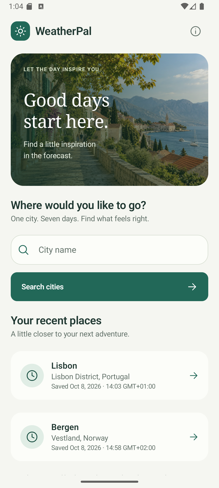
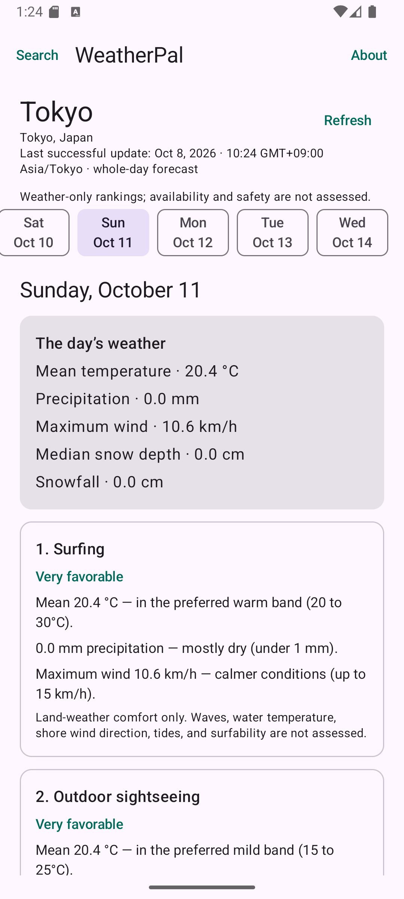

# WeatherPal

A native Android app that searches cities with Open-Meteo and ranks skiing, surfing, outdoor sightseeing, and indoor sightseeing for seven city-local dates. It includes offline access to three recent cities, pull-to-refresh, light/dark themes, and expandable activity explanations. No backend or API key is required.

 

## Build and run

Open the project in Android Studio with **JDK 21**, **Android SDK 36**, and **Build Tools 36.0.0**. Let Android Studio create `local.properties` with your SDK path, sync Gradle, and run `app` on an API 24+ device.

```powershell
$env:JAVA_HOME = 'C:/Program Files/Android/Android Studio/jbr'
./gradlew.bat :app:assembleDebug
./gradlew.bat :app:installDebug
```

Adjust `JAVA_HOME` for your installation. On macOS/Linux, use `./gradlew` instead. The debug APK is at `app/build/outputs/apk/debug/app-debug.apk`.

The project uses Gradle 8.13, min SDK 24, and compile/target SDK 36. Java/Kotlin bytecode targets 11; core-library desugaring supports `java.time` on older devices. Dependency versions are pinned in [the version catalog](gradle/libs.versions.toml).

## Architecture and decisions

**Kotlin, Compose/Material 3, MVVM, Coroutines/StateFlow, Retrofit/OkHttp, and Room.** One app module keeps build setup small; package boundaries separate the responsibilities:

```text
com.example.weatherpal
├── domain/    Models, repository contracts, scoring, weather normalization
├── data/      Remote APIs, Room persistence, repository implementations
├── ui/        Search/forecast screens and state, shared components, formatting
├── di/        Application-scoped wiring and ViewModel factory
└── core/      Injectable coroutine dispatcher
```

- **Manual constructor injection:** repositories, clock, dispatcher, and cache policy can be replaced in tests without a DI framework. UI state is defined separately from ViewModel orchestration; scoring has no Android dependencies.
- **Explicit state:** search distinguishes idle/loading/results/empty/error. Forecast content and refresh status are independent, so a failed refresh leaves existing content usable. Request identity and cancellation prevent late responses from overwriting current navigation.
- **Room as the source of truth:** validated responses are committed before display. Forecast changes, timestamps, and eviction share a transaction; unchanged day rows are not rewritten. The cache holds three cities, evicting the oldest successful update rather than the least recently opened city.
- **Stable date selection:** the timeline and pager share one city/date selection. Refresh preserves it; resume and local midnight reconcile the window. Missing or expired dates are shown as unavailable.
- **Explicit search submission:** typing does not issue requests. This keeps request volume and cancellation behavior predictable at the cost of live suggestions.

## API and recommendation logic

City search uses the [Open-Meteo Geocoding API](https://open-meteo.com/en/docs/geocoding-api), requesting up to ten English results. City IDs preserve identity; region/country disambiguate names. Forecast requests use the selected coordinates/timezone and `forecast_days=7`. Location data is backed by [GeoNames](https://www.geonames.org/); attribution is also available in About.

The [Forecast API](https://open-meteo.com/en/docs) fields were chosen for explainable daily recommendations:

- `temperature_2m_mean` (°C): whole-day comfort.
- `precipitation_sum` (mm, including snow water equivalent): wet-weather impact.
- `wind_speed_10m_max` (km/h): a conservative wind-comfort signal.
- `snow_depth` (hourly meters, converted to centimeters): evidence of modeled snow cover.
- `snowfall_sum` (daily centimeters): a fallback when snow depth is unavailable.

Dates, units, timezone, and array lengths are validated before persistence. Missing values stay unavailable rather than becoming zero. Hourly snow depth uses a daily median with at least half the expected readings; coverage accounts for 23/25-hour DST days.

The deterministic scoring rules live in [ActivityScorer](app/src/main/java/com/example/weatherpal/domain/scoring/ActivityScorer.kt), with examples and boundary checks in [ActivityScorerTest](app/src/test/java/com/example/weatherpal/domain/scoring/ActivityScorerTest.kt):

- **Outdoor sightseeing:** mild, dry, calm weather; temperature/precipitation/wind contribute up to 45/35/20 points.
- **Surfing:** warmer land-weather comfort; the same inputs contribute up to 45/30/25 points. This does not assess waves or coastline access.
- **Skiing:** snow/temperature/wind contribute up to 60/25/15 points. Usable depth takes precedence, including zero. Snowfall fallback contributes up to 45 points; a zero snow signal caps the total at 39.
- **Indoor sightseeing:** `100 − outdoor score`, expressing the relative appeal of indoor plans as outdoor weather worsens.

Scores are clamped to 0–100 and sorted descending; ties follow skiing, surfing, outdoor, indoor. Missing required inputs produce **Insufficient data**, sorted last. The UI shows explanations and labels: Very favorable (90+), Favorable (70–89), Mixed (40–69), or Unfavorable (0–39).

Requests have a 20-second total timeout. Errors offer explicit retry; HTTP 429 Retry-After deadlines are honored across navigation and searches for the app process. Cached forecasts survive network/validation/storage failures. There is no automatic application-level retry loop.

## Tests

```powershell
./gradlew.bat :app:testDebugUnitTest
./gradlew.bat :app:connectedDebugAndroidTest
./gradlew.bat :app:verifyRoborazziDebug --tests '*WeatherSnapshotTest*'
./gradlew.bat :app:assembleDebug :app:testDebugUnitTest :app:lintDebug
```

The suite contains **46 unit tests**, **11 device tests**, and **34 visual snapshots**. Unit tests cover scoring boundaries, snow/DST handling, HTTP contracts, cache coordination, cancellation, retry, saved state, and date preservation. Injected clocks/dispatchers, handwritten fakes, and MockWebServer keep them independent of live APIs.

Device tests verify Room transactions/selective writes/persistence and Compose interactions; they require a running emulator or device. Snapshots cover both themes, errors, offline data, landscape, and large text. Use Windows/JDK 21 for pixel comparisons; ordinary unit runs skip snapshot rendering. See [snapshot maintenance](docs/snapshot-testing.md).

[CI](.github/workflows/android-checks.yml) configures Linux build/unit/lint and Windows snapshot checks. Connected tests run locally. Local verification uses Windows, JDK 21, and an API 36 emulator; hosted CI has not yet been verified.

## Assumptions, trade-offs, and production work

Seven days means **today plus six days in the city's timezone**. Today's ranking uses the whole-day forecast, including elapsed hours. The heuristics are planning aids: they do not verify resorts, attractions, surf conditions, availability, or safety. Daily averages hide intraday variation, and the weights have not been calibrated against user outcomes.

The scope is English, metric units, manual city entry, and foreground refresh. Offline search, GPS, background sync, ocean/resort integrations, and full UI coverage are omitted. One module and manual DI suit this app's size; larger scope may justify stronger module boundaries. Device-clock recency and process-scoped rate limits favor simplicity.

Before release: validate recommendations, review [API licensing/access](https://open-meteo.com/en/terms), add tested database migrations, configure signing/minification and backup/privacy policies, and broaden physical-device, minimum-API, accessibility, and process-death testing. Saved-state reconstruction is unit-tested; full OS process-death recovery remains unverified. Visual polish and snapshots were added after the functional implementation; this is broader than a strict 3–4-hour submission.

## Cross-platform delivery

This delivery is Android-only. An iOS version could use SwiftUI, URLSession/Swift concurrency, protocol-based injection, and native persistence while retaining the API contracts, scoring examples, and cache/date behavior. No shared Kotlin module or iOS implementation is included.

## AI assistance

AI assisted specification, code, tests, review, and documentation, and generated the bundled illustrative activity images. Scoring decisions were reviewed and accepted. Recommendations and explanations run deterministically on-device; no AI service is called at runtime. Verification uses builds, automated tests, lint, and emulator checks; coverage limits are listed above.
